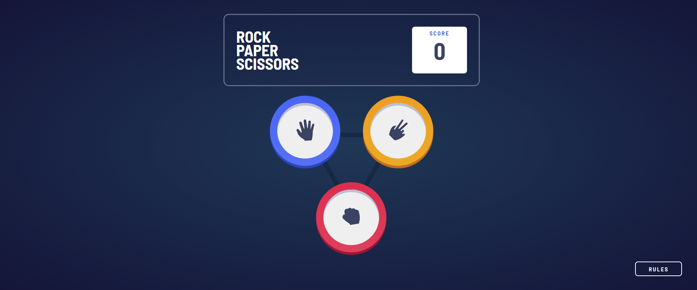
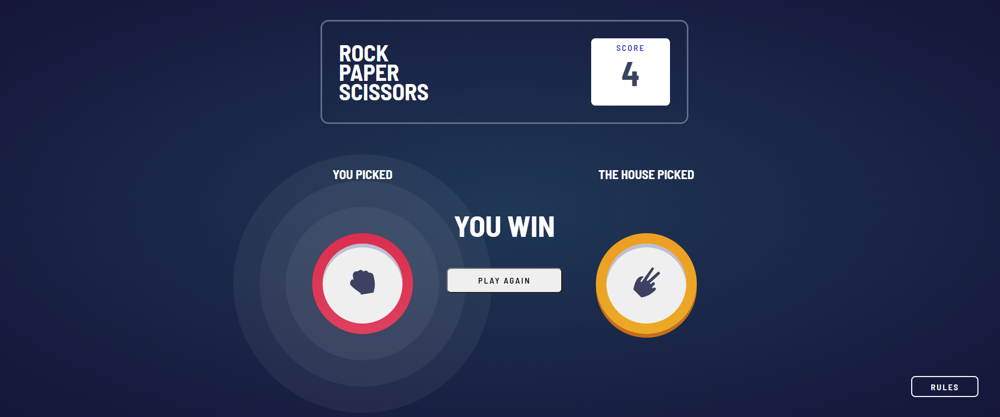
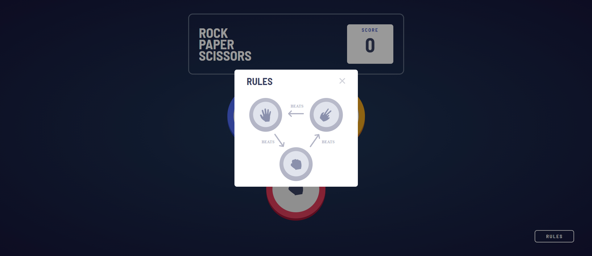
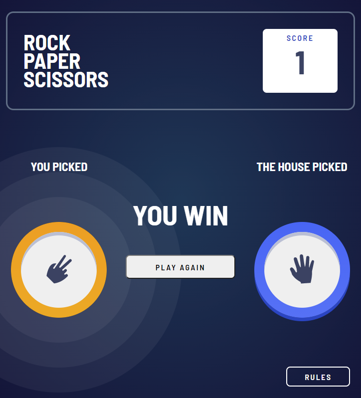

# Game of Rock, Paper, Scissors

This is a solution to Game of Rock, Paper, Scissors.

The Users should be able to:

- View the optimal layout for the game depending on their device's screen size
- Play Rock, Paper, Scissors against the computer

## Rules

If the player wins, the player gains 1 point. If the computer wins, the player loses one point.

- Paper beats Rock
- Rock beats Scissors
- Scissors beats Paper

## Table of contents

- [Overview](#overview)
  - [Link](#link)
  - [Screenshots](#screenshots)
- [My process](#my-process)
  - [Built with](#built-with)
- [Author](#author)

## Overview

### Link

- Solution URL: [Add solution URL here](https://your-solution-url.com)

### Screenshots

## My process

### Built with

- Semantic HTML5 markup
- CSS custom properties
- Flexbox
- CSS Grid
- jQuery

### Useful resources

- [box-shadow](https://css-tricks.com/almanac/properties/b/box-shadow/) 

## Author

- Website - [Xiaomin Guo](https://min-website-aislandmin.vercel.app/)

